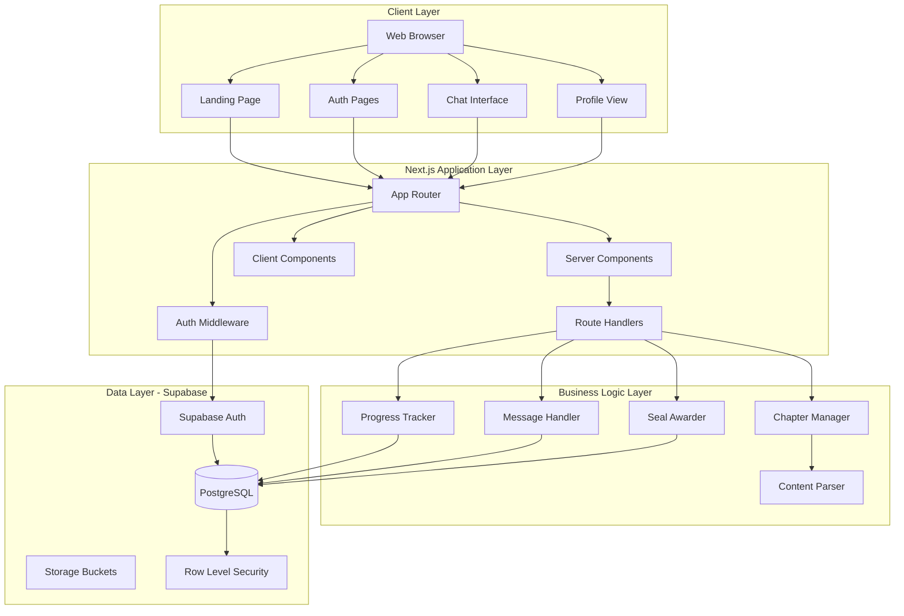
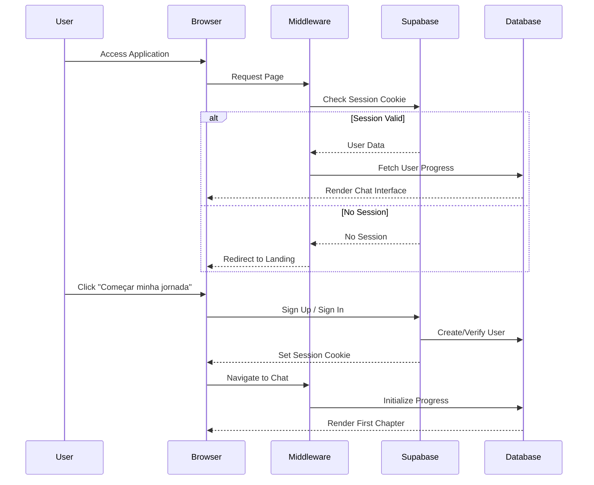
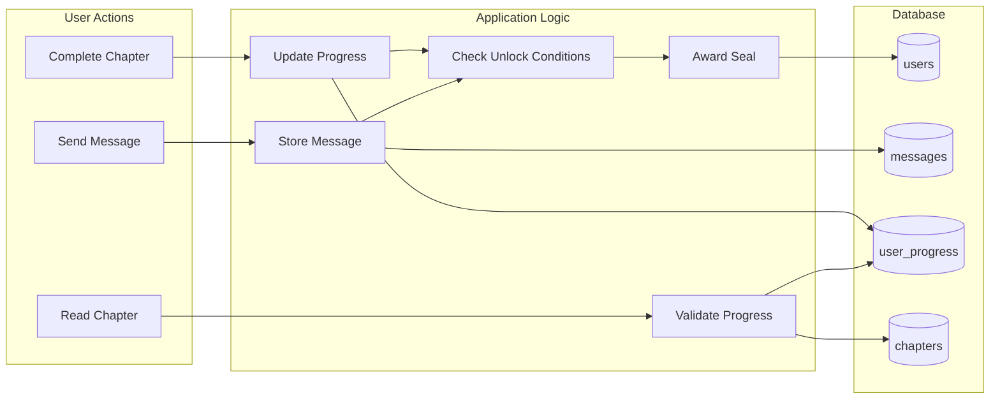

# Design Document: Interactive Spiritual Book System

## Overview

The Interactive Spiritual Book System is a web application that delivers spiritual content through a chat-like interface, creating an intimate reading experience focused on building a relationship with God as Father. The system combines progressive content unlocking, personal message recording, and symbolic identity creation through a digital seal award.

### Core Design Principles

1. **Intimacy Over Functionality**: The interface prioritizes emotional connection over feature richness
2. **Progressive Disclosure**: Content unlocks sequentially to maintain narrative flow
3. **Conversational Experience**: Chat-style UI creates a personal, dialogue-like atmosphere
4. **Minimalist Aesthetics**: Dark theme with strong typography eliminates distractions
5. **Mobile-First**: Optimized for personal, on-the-go spiritual reflection

### Technology Stack

- **Frontend Framework**: Next.js 14 with App Router
- **UI Library**: React 18
- **Styling**: TailwindCSS with custom dark theme
- **Backend**: Supabase (PostgreSQL database, authentication, real-time subscriptions)
- **Deployment**: Vercel (recommended for Next.js optimization)
- **Language**: TypeScript for type safety

### Key Architectural Decisions

**Why Next.js App Router**: Server components enable efficient data fetching and authentication checks without client-side overhead, improving initial load times for spiritual content.

**Why Supabase**: Provides integrated authentication, PostgreSQL database with Row Level Security for data isolation, and real-time capabilities for future enhancements—all without managing backend infrastructure.

**Why Chat Interface**: The conversational format creates psychological intimacy, making spiritual content feel like a personal dialogue rather than a lecture or course.

## Architecture

### System Architecture



### Authentication Flow



### Data Flow



## Components and Interfaces

### Frontend Component Structure

```
app/
├── (auth)/
│   ├── login/
│   │   └── page.tsx              # Login page (Server Component)
│   └── signup/
│       └── page.tsx              # Signup page (Server Component)
├── (protected)/
│   ├── journey/
│   │   └── page.tsx              # Main chat interface (Server Component)
│   └── profile/
│       └── page.tsx              # User profile with seal (Server Component)
├── layout.tsx                    # Root layout with providers
├── page.tsx                      # Landing page (Server Component)
└── middleware.ts                 # Auth middleware

components/
├── chat/
│   ├── ChatContainer.tsx         # Main chat wrapper (Client Component)
│   ├── MessageList.tsx           # Scrollable message area (Client Component)
│   ├── ContentMessage.tsx        # Left-aligned content bubble (Client Component)
│   ├── UserMessage.tsx           # Right-aligned user bubble (Client Component)
│   ├── MessageInput.tsx          # Text input with send button (Client Component)
│   └── TypingIndicator.tsx      # Optional loading state (Client Component)
├── progress/
│   ├── ProgressBar.tsx           # Visual progress indicator (Client Component)
│   ├── ChapterList.tsx           # Chapter navigation (Client Component)
│   └── ChapterLock.tsx           # Locked chapter indicator (Client Component)
├── seal/
│   ├── DigitalSeal.tsx           # Seal display component (Client Component)
│   └── SealAward.tsx             # Seal award animation (Client Component)
├── landing/
│   ├── EmotionalHero.tsx         # Landing page hero (Client Component)
│   └── JourneyButton.tsx         # CTA button (Client Component)
└── providers/
    ├── AuthProvider.tsx          # Auth context provider (Client Component)
    └── SupabaseProvider.tsx      # Supabase client provider (Client Component)

lib/
├── supabase/
│   ├── client.ts                 # Browser Supabase client
│   ├── server.ts                 # Server Supabase client
│   └── middleware.ts             # Middleware Supabase client
├── services/
│   ├── chapterService.ts         # Chapter data operations
│   ├── messageService.ts         # Message CRUD operations
│   ├── progressService.ts        # Progress tracking logic
│   └── sealService.ts            # Seal award logic
├── parsers/
│   └── contentParser.ts          # Chapter content parsing
└── types/
    ├── database.types.ts         # Supabase generated types
    └── domain.types.ts           # Application domain types
```

### Key Component Interfaces

#### ChatContainer Component

```typescript
interface ChatContainerProps {
  initialMessages: Message[];
  currentChapter: Chapter;
  userId: string;
  canSendMessage: boolean;
}

// Manages chat state, message submission, optimistic updates
// Handles scroll behavior and message rendering
```

#### MessageList Component

```typescript
interface MessageListProps {
  messages: Message[];
  isLoading: boolean;
}

// Renders scrollable message list
// Auto-scrolls to bottom on new messages
// Distinguishes content vs user messages
```

#### MessageInput Component

```typescript
interface MessageInputProps {
  onSendMessage: (content: string) => Promise<void>;
  disabled: boolean;
  placeholder?: string;
}

// Text input with send button
// Handles enter key submission
// Disables during submission
// Clears input after successful send
```

#### ProgressBar Component

```typescript
interface ProgressBarProps {
  totalChapters: number;
  completedChapters: number;
  currentChapter: number;
}

// Visual progress indicator
// Shows completion percentage
// Highlights current chapter
```

#### DigitalSeal Component

```typescript
interface DigitalSealProps {
  awarded: boolean;
  awardedAt?: Date;
  variant?: 'full' | 'compact';
}

// Displays "Faço parte do movimento Deus é Pai"
// Shows award date if available
// Supports different display sizes
```

### Service Layer Interfaces

#### ChapterService

```typescript
interface ChapterService {
  // Fetch all chapters (content only, no user-specific data)
  getAllChapters(): Promise<Chapter[]>;
  
  // Get specific chapter by ID
  getChapterById(chapterId: string): Promise<Chapter | null>;
  
  // Get chapter content parsed into message blocks
  getChapterMessages(chapterId: string): Promise<ContentMessage[]>;
  
  // Validate chapter order and prerequisites
  validateChapterAccess(chapterId: string, userId: string): Promise<boolean>;
}
```

#### MessageService

```typescript
interface MessageService {
  // Store user message
  createMessage(userId: string, chapterId: string, content: string): Promise<Message>;
  
  // Get all messages for a user in a chapter
  getMessagesByChapter(userId: string, chapterId: string): Promise<Message[]>;
  
  // Get all user messages across journey
  getAllUserMessages(userId: string): Promise<Message[]>;
  
  // Count user messages (for seal unlock condition)
  getUserMessageCount(userId: string): Promise<number>;
}
```

#### ProgressService

```typescript
interface ProgressService {
  // Initialize progress for new user
  initializeProgress(userId: string): Promise<UserProgress>;
  
  // Get user's current progress
  getProgress(userId: string): Promise<UserProgress>;
  
  // Mark chapter as completed
  completeChapter(userId: string, chapterId: string): Promise<UserProgress>;
  
  // Check if chapter is unlocked
  isChapterUnlocked(userId: string, chapterId: string): Promise<boolean>;
  
  // Get next unlocked chapter
  getNextChapter(userId: string): Promise<Chapter | null>;
}
```

#### SealService

```typescript
interface SealService {
  // Check if user has earned seal
  hasSeal(userId: string): Promise<boolean>;
  
  // Award seal to user
  awardSeal(userId: string, reason: 'journey_complete' | 'first_message'): Promise<void>;
  
  // Check seal unlock conditions
  checkSealConditions(userId: string): Promise<{
    journeyComplete: boolean;
    firstMessageSent: boolean;
    shouldAward: boolean;
  }>;
}
```

#### ContentParser

```typescript
interface ContentParser {
  // Parse chapter content from structured format
  parseChapter(rawContent: string): ParsedChapter;
  
  // Validate chapter structure
  validateChapterStructure(rawContent: string): ValidationResult;
  
  // Format parsed content back to structured format
  formatChapter(parsed: ParsedChapter): string;
  
  // Extract message blocks from chapter
  extractMessages(parsed: ParsedChapter): ContentMessage[];
}

interface ParsedChapter {
  id: string;
  title: string;
  messages: ContentMessage[];
  metadata: ChapterMetadata;
}

interface ContentMessage {
  id: string;
  content: string;
  order: number;
  delay?: number; // Optional delay for sequential display
}

interface ValidationResult {
  valid: boolean;
  errors: string[];
}
```

## Data Models

### Database Schema

```sql
-- Users table (managed by Supabase Auth)
-- Extended with custom fields
CREATE TABLE public.profiles (
  id UUID REFERENCES auth.users(id) PRIMARY KEY,
  created_at TIMESTAMPTZ DEFAULT NOW(),
  updated_at TIMESTAMPTZ DEFAULT NOW(),
  display_name TEXT,
  seal_awarded BOOLEAN DEFAULT FALSE,
  seal_awarded_at TIMESTAMPTZ,
  seal_unlock_reason TEXT CHECK (seal_unlock_reason IN ('journey_complete', 'first_message'))
);

-- Chapters table (static content)
CREATE TABLE public.chapters (
  id UUID PRIMARY KEY DEFAULT gen_random_uuid(),
  order_index INTEGER NOT NULL UNIQUE,
  title TEXT NOT NULL,
  content JSONB NOT NULL, -- Structured chapter content
  created_at TIMESTAMPTZ DEFAULT NOW(),
  updated_at TIMESTAMPTZ DEFAULT NOW()
);

-- User progress tracking
CREATE TABLE public.user_progress (
  id UUID PRIMARY KEY DEFAULT gen_random_uuid(),
  user_id UUID REFERENCES public.profiles(id) ON DELETE CASCADE NOT NULL,
  chapter_id UUID REFERENCES public.chapters(id) ON DELETE CASCADE NOT NULL,
  completed BOOLEAN DEFAULT FALSE,
  completed_at TIMESTAMPTZ,
  created_at TIMESTAMPTZ DEFAULT NOW(),
  updated_at TIMESTAMPTZ DEFAULT NOW(),
  UNIQUE(user_id, chapter_id)
);

-- User messages
CREATE TABLE public.messages (
  id UUID PRIMARY KEY DEFAULT gen_random_uuid(),
  user_id UUID REFERENCES public.profiles(id) ON DELETE CASCADE NOT NULL,
  chapter_id UUID REFERENCES public.chapters(id) ON DELETE CASCADE NOT NULL,
  content TEXT NOT NULL,
  created_at TIMESTAMPTZ DEFAULT NOW()
);

-- Indexes for performance
CREATE INDEX idx_user_progress_user_id ON public.user_progress(user_id);
CREATE INDEX idx_user_progress_chapter_id ON public.user_progress(chapter_id);
CREATE INDEX idx_messages_user_id ON public.messages(user_id);
CREATE INDEX idx_messages_chapter_id ON public.messages(chapter_id);
CREATE INDEX idx_messages_created_at ON public.messages(created_at DESC);
CREATE INDEX idx_chapters_order ON public.chapters(order_index);
```

### Row Level Security Policies

```sql
-- Enable RLS on all tables
ALTER TABLE public.profiles ENABLE ROW LEVEL SECURITY;
ALTER TABLE public.chapters ENABLE ROW LEVEL SECURITY;
ALTER TABLE public.user_progress ENABLE ROW LEVEL SECURITY;
ALTER TABLE public.messages ENABLE ROW LEVEL SECURITY;

-- Profiles: Users can read and update their own profile
CREATE POLICY "Users can view own profile"
  ON public.profiles FOR SELECT
  USING (auth.uid() = id);

CREATE POLICY "Users can update own profile"
  ON public.profiles FOR UPDATE
  USING (auth.uid() = id);

-- Chapters: All authenticated users can read chapters
CREATE POLICY "Authenticated users can read chapters"
  ON public.chapters FOR SELECT
  TO authenticated
  USING (true);

-- User Progress: Users can only access their own progress
CREATE POLICY "Users can view own progress"
  ON public.user_progress FOR SELECT
  USING (auth.uid() = user_id);

CREATE POLICY "Users can insert own progress"
  ON public.user_progress FOR INSERT
  WITH CHECK (auth.uid() = user_id);

CREATE POLICY "Users can update own progress"
  ON public.user_progress FOR UPDATE
  USING (auth.uid() = user_id);

-- Messages: Users can only access their own messages
CREATE POLICY "Users can view own messages"
  ON public.messages FOR SELECT
  USING (auth.uid() = user_id);

CREATE POLICY "Users can insert own messages"
  ON public.messages FOR INSERT
  WITH CHECK (auth.uid() = user_id);

-- Note: No update or delete policies for messages (immutable)
```

### TypeScript Domain Types

```typescript
// User Profile
interface Profile {
  id: string;
  created_at: string;
  updated_at: string;
  display_name: string | null;
  seal_awarded: boolean;
  seal_awarded_at: string | null;
  seal_unlock_reason: 'journey_complete' | 'first_message' | null;
}

// Chapter
interface Chapter {
  id: string;
  order_index: number;
  title: string;
  content: ChapterContent;
  created_at: string;
  updated_at: string;
}

interface ChapterContent {
  messages: ChapterMessage[];
  metadata?: {
    theme?: string;
    estimatedReadTime?: number;
  };
}

interface ChapterMessage {
  id: string;
  content: string;
  order: number;
  delay?: number;
}

// User Progress
interface UserProgress {
  id: string;
  user_id: string;
  chapter_id: string;
  completed: boolean;
  completed_at: string | null;
  created_at: string;
  updated_at: string;
}

// User Message
interface Message {
  id: string;
  user_id: string;
  chapter_id: string;
  content: string;
  created_at: string;
}

// Aggregated Progress View
interface JourneyProgress {
  totalChapters: number;
  completedChapters: number;
  currentChapterIndex: number;
  percentComplete: number;
  chapters: ChapterProgress[];
}

interface ChapterProgress {
  chapter: Chapter;
  completed: boolean;
  unlocked: boolean;
  completedAt: string | null;
}

// Message Display Types
type DisplayMessage = ContentDisplayMessage | UserDisplayMessage;

interface ContentDisplayMessage {
  type: 'content';
  id: string;
  content: string;
  order: number;
}

interface UserDisplayMessage {
  type: 'user';
  id: string;
  content: string;
  created_at: string;
}
```

### Chapter Content Format

Chapters are stored as JSONB with the following structure:

```json
{
  "messages": [
    {
      "id": "msg-1",
      "content": "Você já se sentiu sozinho, mesmo cercado de pessoas?",
      "order": 1,
      "delay": 0
    },
    {
      "id": "msg-2",
      "content": "Como se ninguém realmente te conhecesse?",
      "order": 2,
      "delay": 2000
    },
    {
      "id": "msg-3",
      "content": "Essa sensação tem um nome: orfandade espiritual.",
      "order": 3,
      "delay": 3000
    }
  ],
  "metadata": {
    "theme": "spiritual_orphanhood",
    "estimatedReadTime": 5
  }
}
```

The `delay` field enables sequential message display for dramatic effect (optional feature).

## Correctness Properties

*A property is a characteristic or behavior that should hold true across all valid executions of a system—essentially, a formal statement about what the system should do. Properties serve as the bridge between human-readable specifications and machine-verifiable correctness guarantees.*

### Property 1: Chapter Sequential Ordering

*For any* set of chapters, when retrieved by the system, they SHALL be ordered by their `order_index` field in ascending order.

**Validates: Requirements 1.3**

### Property 2: Chapter Rendering Produces Message Blocks

*For any* valid chapter content, when rendered by the system, the output SHALL contain individual message blocks in the order specified by the content.

**Validates: Requirements 1.2, 2.1**

### Property 3: Chapter Completion Updates Progress

*For any* user and chapter, when the user completes that chapter, the system SHALL create or update a progress record with `completed = true` for that user-chapter pair.

**Validates: Requirements 1.4**

### Property 4: Chapter Access Control

*For any* chapter N with order_index > 1, a user SHALL NOT be able to access chapter N if any chapter with order_index < N is not marked as completed in their progress.

**Validates: Requirements 1.5**

### Property 5: User Message Persistence

*For any* authenticated user and message content, when the user submits a message, the system SHALL store that message in the database associated with the user's ID and current chapter ID.

**Validates: Requirements 3.3, 10.1**

### Property 6: User Message Display Alignment

*For any* user-submitted message, when displayed in the chat interface, the message SHALL be rendered with right-side alignment styling.

**Validates: Requirements 3.2**

### Property 7: No Automated Responses

*For any* user message submission, the system SHALL NOT create or display any automated response messages.

**Validates: Requirements 3.5**

### Property 8: Progress Indicator Reactivity

*For any* user progress state, when a chapter is marked as completed, the progress indicator SHALL update to reflect the new count of completed chapters.

**Validates: Requirements 4.2**

### Property 9: Chapter Completion Status Display

*For any* set of chapters and user progress, each chapter SHALL display its completion status (completed or not completed) based on the user's progress records.

**Validates: Requirements 4.4**

### Property 10: Data Persistence Round-Trip

*For any* user's journey data (messages, progress, seal status), when stored to the database and subsequently retrieved, the retrieved data SHALL be equivalent to the stored data.

**Validates: Requirements 4.5, 10.4, 10.5**

### Property 11: Sequential Chapter Unlocking

*For any* chapter N, when a user completes chapter N, the system SHALL make chapter N+1 accessible to that user (if chapter N+1 exists).

**Validates: Requirements 5.2**

### Property 12: Locked Chapter Visual Indication

*For any* chapter that is locked for a user, when displayed in the interface, the chapter SHALL include a visual indicator of its locked state.

**Validates: Requirements 5.3**

### Property 13: Locked Chapter Navigation Prevention

*For any* locked chapter, when a user attempts to navigate to that chapter, the system SHALL prevent the navigation and display a message indicating the chapter is not yet available.

**Validates: Requirements 5.4, 5.5**

### Property 14: Journey Completion Awards Seal

*For any* user, when that user completes all chapters in the journey, the system SHALL award the Digital Seal to that user by setting `seal_awarded = true` in their profile.

**Validates: Requirements 7.1**

### Property 15: Digital Seal Text Content

*For any* rendered Digital Seal component, the displayed text SHALL include "Faço parte do movimento Deus é Pai".

**Validates: Requirements 7.2**

### Property 16: Digital Seal Display in Profile

*For any* user who has been awarded the Digital Seal, the seal SHALL be displayed in the user's profile view or journey view.

**Validates: Requirements 7.5**

### Property 17: First Message Awards Seal (Alternative Unlock)

*For any* user, when the alternative unlock condition is enabled and the user submits their first message, the system SHALL award the Digital Seal to that user.

**Validates: Requirements 8.1**

### Property 18: Seal Award Idempotence

*For any* user, awarding the Digital Seal multiple times (via any combination of unlock conditions) SHALL result in the same state as awarding it once: `seal_awarded = true` with a single `seal_awarded_at` timestamp.

**Validates: Requirements 8.2**

### Property 19: Seal Award Notification

*For any* user, when the Digital Seal is awarded via the first message condition, the system SHALL display a notification to the user.

**Validates: Requirements 8.4**

### Property 20: Seal Award Persistence Consistency

*For any* user, the Digital Seal award SHALL be persisted in the database with the same data structure regardless of which unlock condition triggered the award.

**Validates: Requirements 8.5**

### Property 21: Session Maintenance After Authentication

*For any* user who successfully authenticates, the system SHALL create and maintain a session that persists across page navigations within the application.

**Validates: Requirements 9.5**

### Property 22: Authentication Failure Error Display

*For any* authentication attempt with invalid credentials, the system SHALL display an error message to the user.

**Validates: Requirements 9.6**

### Property 23: User Data Isolation

*For any* two distinct users, the messages, progress, and seal status for user A SHALL NOT be accessible to user B through the application interface or API.

**Validates: Requirements 10.6**

### Property 24: Responsive Touch Target Sizing

*For any* interactive UI element (buttons, inputs, links), the element SHALL have a minimum touch target size of 44x44 pixels to ensure mobile accessibility.

**Validates: Requirements 11.3**

### Property 25: Content Parser Validation

*For any* chapter content input, the content parser SHALL correctly identify whether the content conforms to the expected structure and return appropriate validation results.

**Validates: Requirements 13.3**

### Property 26: Content Parser Error Messages

*For any* invalid chapter content, when validation fails, the content parser SHALL return a descriptive error message indicating what aspect of the structure is invalid.

**Validates: Requirements 13.4**

### Property 27: Content Parser Round-Trip

*For any* valid chapter content, parsing the content, then formatting the parsed result, then parsing again SHALL produce structured data equivalent to the first parse result.

**Validates: Requirements 13.6**

### Property 28: Session Creation on Authentication

*For any* user who successfully authenticates, the system SHALL create a session with a session token stored in an HTTP-only cookie.

**Validates: Requirements 14.1**

### Property 29: Session Restoration

*For any* active session, when a user closes and reopens the application within the session duration, the system SHALL restore the authenticated state without requiring re-authentication.

**Validates: Requirements 14.3**

### Property 30: Logout Terminates Session

*For any* active user session, when the user invokes the logout function, the system SHALL terminate the session and clear the session token.

**Validates: Requirements 14.5**

### Property 31: Storage Failure Error Display

*For any* data storage operation that fails, the system SHALL display an error message to the user indicating the operation failed.

**Validates: Requirements 15.1**

### Property 32: Retrieval Failure Error Display

*For any* data retrieval operation that fails, the system SHALL display an error message to the user indicating the operation failed.

**Validates: Requirements 15.2**

### Property 33: Authentication Failure Specific Error

*For any* authentication failure, the system SHALL display a specific error message indicating authentication failed (distinct from other error types).

**Validates: Requirements 15.3**

### Property 34: Error Logging

*For any* error that occurs in the system, the system SHALL create a log entry containing error details (type, message, stack trace, timestamp).

**Validates: Requirements 15.4**

### Property 35: Network Error Connectivity Message

*For any* network error, the system SHALL display a message to the user indicating connectivity issues.

**Validates: Requirements 15.5**


## Error Handling

### Error Categories

The system handles four primary categories of errors:

1. **Authentication Errors**: Invalid credentials, expired sessions, unauthorized access
2. **Data Operation Errors**: Database failures, network timeouts, data validation failures
3. **Content Errors**: Invalid chapter structure, missing content, parsing failures
4. **Client Errors**: Network connectivity issues, browser compatibility, invalid user input

### Error Handling Strategy

#### Authentication Errors

```typescript
// Authentication error types
type AuthError = 
  | 'invalid_credentials'
  | 'session_expired'
  | 'unauthorized'
  | 'email_not_confirmed'
  | 'rate_limit_exceeded';

// Error handling in auth service
async function handleAuthError(error: AuthError): Promise<void> {
  const errorMessages: Record<AuthError, string> = {
    invalid_credentials: 'Email ou senha incorretos. Tente novamente.',
    session_expired: 'Sua sessão expirou. Por favor, faça login novamente.',
    unauthorized: 'Você não tem permissão para acessar este recurso.',
    email_not_confirmed: 'Por favor, confirme seu email antes de continuar.',
    rate_limit_exceeded: 'Muitas tentativas. Aguarde alguns minutos e tente novamente.'
  };
  
  // Display user-friendly error message
  showErrorToast(errorMessages[error]);
  
  // Log error for debugging
  logger.error('Authentication error', { type: error, timestamp: new Date() });
  
  // Redirect to appropriate page if needed
  if (error === 'session_expired') {
    redirectToLogin();
  }
}
```

#### Data Operation Errors

```typescript
// Data operation error handling
async function safeDataOperation<T>(
  operation: () => Promise<T>,
  context: string
): Promise<T | null> {
  try {
    return await operation();
  } catch (error) {
    // Log detailed error for debugging
    logger.error(`Data operation failed: ${context}`, {
      error: error instanceof Error ? error.message : 'Unknown error',
      stack: error instanceof Error ? error.stack : undefined,
      context,
      timestamp: new Date()
    });
    
    // Determine user-facing message based on error type
    if (error instanceof NetworkError) {
      showErrorToast('Problema de conexão. Verifique sua internet e tente novamente.');
    } else if (error instanceof ValidationError) {
      showErrorToast('Dados inválidos. Por favor, verifique e tente novamente.');
    } else {
      showErrorToast('Algo deu errado. Tente novamente em alguns instantes.');
    }
    
    return null;
  }
}

// Usage example
const message = await safeDataOperation(
  () => messageService.createMessage(userId, chapterId, content),
  'create_user_message'
);
```

#### Content Parsing Errors

```typescript
// Content parser error handling
interface ParseError {
  field: string;
  message: string;
  received?: unknown;
}

function validateChapterContent(content: unknown): ParseError[] {
  const errors: ParseError[] = [];
  
  if (!content || typeof content !== 'object') {
    errors.push({
      field: 'content',
      message: 'Chapter content must be an object'
    });
    return errors;
  }
  
  const chapter = content as Record<string, unknown>;
  
  if (!Array.isArray(chapter.messages)) {
    errors.push({
      field: 'messages',
      message: 'Chapter must contain a messages array',
      received: typeof chapter.messages
    });
  } else {
    chapter.messages.forEach((msg, index) => {
      if (!msg.content || typeof msg.content !== 'string') {
        errors.push({
          field: `messages[${index}].content`,
          message: 'Message content must be a string',
          received: typeof msg.content
        });
      }
      if (typeof msg.order !== 'number') {
        errors.push({
          field: `messages[${index}].order`,
          message: 'Message order must be a number',
          received: typeof msg.order
        });
      }
    });
  }
  
  return errors;
}
```

#### Network Error Handling

```typescript
// Network error detection and handling
async function fetchWithRetry<T>(
  fetcher: () => Promise<T>,
  maxRetries: number = 3,
  delayMs: number = 1000
): Promise<T> {
  let lastError: Error;
  
  for (let attempt = 0; attempt < maxRetries; attempt++) {
    try {
      return await fetcher();
    } catch (error) {
      lastError = error as Error;
      
      // Check if error is network-related
      if (isNetworkError(error)) {
        logger.warn(`Network error, attempt ${attempt + 1}/${maxRetries}`, {
          error: lastError.message
        });
        
        // Wait before retrying
        if (attempt < maxRetries - 1) {
          await delay(delayMs * (attempt + 1)); // Exponential backoff
        }
      } else {
        // Non-network error, don't retry
        throw error;
      }
    }
  }
  
  // All retries failed
  showErrorToast('Não foi possível conectar ao servidor. Verifique sua conexão.');
  throw lastError!;
}

function isNetworkError(error: unknown): boolean {
  if (error instanceof Error) {
    return (
      error.message.includes('network') ||
      error.message.includes('fetch') ||
      error.message.includes('timeout') ||
      error.name === 'NetworkError'
    );
  }
  return false;
}
```

### Error Boundaries

React Error Boundaries catch rendering errors and prevent full application crashes:

```typescript
// Error boundary component
class ChatErrorBoundary extends React.Component<
  { children: React.ReactNode },
  { hasError: boolean; error?: Error }
> {
  constructor(props: { children: React.ReactNode }) {
    super(props);
    this.state = { hasError: false };
  }

  static getDerivedStateFromError(error: Error) {
    return { hasError: true, error };
  }

  componentDidCatch(error: Error, errorInfo: React.ErrorInfo) {
    logger.error('React error boundary caught error', {
      error: error.message,
      stack: error.stack,
      componentStack: errorInfo.componentStack
    });
  }

  render() {
    if (this.state.hasError) {
      return (
        <div className="flex flex-col items-center justify-center min-h-screen p-4">
          <h2 className="text-xl font-semibold mb-4">
            Algo deu errado
          </h2>
          <p className="text-gray-400 mb-6 text-center">
            Ocorreu um erro inesperado. Por favor, recarregue a página.
          </p>
          <button
            onClick={() => window.location.reload()}
            className="px-6 py-2 bg-indigo-600 rounded-lg hover:bg-indigo-700"
          >
            Recarregar página
          </button>
        </div>
      );
    }

    return this.props.children;
  }
}
```

### Logging Strategy

```typescript
// Structured logging interface
interface LogEntry {
  level: 'debug' | 'info' | 'warn' | 'error';
  message: string;
  context?: Record<string, unknown>;
  timestamp: Date;
  userId?: string;
  sessionId?: string;
}

// Logger implementation
class Logger {
  private async send(entry: LogEntry): Promise<void> {
    // In development: console
    if (process.env.NODE_ENV === 'development') {
      console[entry.level](entry.message, entry.context);
    }
    
    // In production: send to logging service
    if (process.env.NODE_ENV === 'production') {
      // Send to external logging service (e.g., Sentry, LogRocket)
      await fetch('/api/logs', {
        method: 'POST',
        body: JSON.stringify(entry)
      }).catch(() => {
        // Silently fail - don't break app if logging fails
      });
    }
  }

  error(message: string, context?: Record<string, unknown>): void {
    this.send({ level: 'error', message, context, timestamp: new Date() });
  }

  warn(message: string, context?: Record<string, unknown>): void {
    this.send({ level: 'warn', message, context, timestamp: new Date() });
  }

  info(message: string, context?: Record<string, unknown>): void {
    this.send({ level: 'info', message, context, timestamp: new Date() });
  }
}

export const logger = new Logger();
```

## Testing Strategy

### Testing Approach

The system employs a dual testing strategy combining **property-based testing** for universal correctness properties and **example-based unit testing** for specific scenarios and edge cases.

### Property-Based Testing

**Library**: [fast-check](https://github.com/dubzzz/fast-check) for TypeScript/JavaScript

**Configuration**: Each property test runs a minimum of 100 iterations to ensure comprehensive input coverage.

**Test Organization**: Property tests are organized by domain (auth, messages, progress, chapters, seal) and tagged with references to design properties.

#### Property Test Examples

```typescript
import fc from 'fast-check';

/**
 * Feature: livro-interativo-espiritual
 * Property 3: Chapter Completion Updates Progress
 * 
 * For any user and chapter, when the user completes that chapter,
 * the system SHALL create or update a progress record with completed = true
 */
describe('Property 3: Chapter Completion Updates Progress', () => {
  it('should mark chapter as completed for any user-chapter pair', async () => {
    await fc.assert(
      fc.asyncProperty(
        fc.uuid(), // userId
        fc.uuid(), // chapterId
        async (userId, chapterId) => {
          // Setup: ensure user and chapter exist
          await setupUser(userId);
          await setupChapter(chapterId);
          
          // Action: complete chapter
          await progressService.completeChapter(userId, chapterId);
          
          // Assertion: progress record exists with completed = true
          const progress = await progressService.getProgress(userId);
          const chapterProgress = progress.chapters.find(
            cp => cp.chapter.id === chapterId
          );
          
          expect(chapterProgress?.completed).toBe(true);
        }
      ),
      { numRuns: 100 }
    );
  });
});

/**
 * Feature: livro-interativo-espiritual
 * Property 27: Content Parser Round-Trip
 * 
 * For any valid chapter content, parsing then formatting then parsing
 * SHALL produce equivalent structured data
 */
describe('Property 27: Content Parser Round-Trip', () => {
  it('should preserve data through parse-format-parse cycle', () => {
    fc.assert(
      fc.property(
        validChapterContentArbitrary(), // Custom generator
        (content) => {
          // Parse -> Format -> Parse
          const parsed1 = contentParser.parseChapter(content);
          const formatted = contentParser.formatChapter(parsed1);
          const parsed2 = contentParser.parseChapter(formatted);
          
          // Assert equivalence
          expect(parsed2).toEqual(parsed1);
        }
      ),
      { numRuns: 100 }
    );
  });
});

// Custom arbitrary for valid chapter content
function validChapterContentArbitrary() {
  return fc.record({
    messages: fc.array(
      fc.record({
        id: fc.uuid(),
        content: fc.string({ minLength: 1, maxLength: 500 }),
        order: fc.nat(),
        delay: fc.option(fc.nat({ max: 10000 }))
      }),
      { minLength: 1, maxLength: 20 }
    ),
    metadata: fc.option(
      fc.record({
        theme: fc.string(),
        estimatedReadTime: fc.nat({ max: 60 })
      })
    )
  });
}
```

### Unit Testing

**Library**: [Vitest](https://vitest.dev/) for fast unit testing with TypeScript support

**Focus Areas**:
- Specific examples demonstrating correct behavior
- Edge cases (empty inputs, boundary values, special characters)
- Integration points between components
- Error conditions and error messages
- UI component rendering with specific props

#### Unit Test Examples

```typescript
import { describe, it, expect, beforeEach } from 'vitest';
import { render, screen } from '@testing-library/react';

describe('MessageInput Component', () => {
  it('should render input field and send button', () => {
    render(<MessageInput onSendMessage={async () => {}} disabled={false} />);
    
    expect(screen.getByPlaceholderText(/digite sua mensagem/i)).toBeInTheDocument();
    expect(screen.getByRole('button', { name: /enviar/i })).toBeInTheDocument();
  });
  
  it('should disable input and button when disabled prop is true', () => {
    render(<MessageInput onSendMessage={async () => {}} disabled={true} />);
    
    const input = screen.getByPlaceholderText(/digite sua mensagem/i);
    const button = screen.getByRole('button', { name: /enviar/i });
    
    expect(input).toBeDisabled();
    expect(button).toBeDisabled();
  });
  
  it('should clear input after successful message send', async () => {
    const mockSend = vi.fn().mockResolvedValue(undefined);
    const { user } = render(
      <MessageInput onSendMessage={mockSend} disabled={false} />
    );
    
    const input = screen.getByPlaceholderText(/digite sua mensagem/i);
    await user.type(input, 'Test message');
    await user.click(screen.getByRole('button', { name: /enviar/i }));
    
    expect(mockSend).toHaveBeenCalledWith('Test message');
    expect(input).toHaveValue('');
  });
  
  it('should reject empty or whitespace-only messages', async () => {
    const mockSend = vi.fn();
    const { user } = render(
      <MessageInput onSendMessage={mockSend} disabled={false} />
    );
    
    const input = screen.getByPlaceholderText(/digite sua mensagem/i);
    
    // Try empty message
    await user.click(screen.getByRole('button', { name: /enviar/i }));
    expect(mockSend).not.toHaveBeenCalled();
    
    // Try whitespace-only message
    await user.type(input, '   ');
    await user.click(screen.getByRole('button', { name: /enviar/i }));
    expect(mockSend).not.toHaveBeenCalled();
  });
});

describe('ProgressService', () => {
  beforeEach(async () => {
    await clearTestDatabase();
  });
  
  it('should initialize progress with only first chapter unlocked', async () => {
    const userId = await createTestUser();
    await seedChapters(5); // Create 5 chapters
    
    const progress = await progressService.initializeProgress(userId);
    
    expect(progress.chapters).toHaveLength(5);
    expect(progress.chapters[0].unlocked).toBe(true);
    expect(progress.chapters.slice(1).every(c => !c.unlocked)).toBe(true);
  });
  
  it('should handle completing the last chapter', async () => {
    const userId = await createTestUser();
    const chapters = await seedChapters(3);
    
    // Complete all chapters
    for (const chapter of chapters) {
      await progressService.completeChapter(userId, chapter.id);
    }
    
    const progress = await progressService.getProgress(userId);
    expect(progress.percentComplete).toBe(100);
    expect(progress.chapters.every(c => c.completed)).toBe(true);
  });
});
```

### Integration Testing

**Focus**: Testing interactions with Supabase (authentication, database operations, RLS policies)

**Approach**: Use Supabase local development environment or test project

```typescript
describe('Supabase Integration', () => {
  it('should enforce RLS policies for user messages', async () => {
    const user1 = await createTestUser();
    const user2 = await createTestUser();
    
    // User 1 creates a message
    const message = await messageService.createMessage(
      user1.id,
      'chapter-1',
      'User 1 message'
    );
    
    // User 2 should not be able to read User 1's message
    const user2Client = createSupabaseClient(user2.session);
    const { data, error } = await user2Client
      .from('messages')
      .select('*')
      .eq('id', message.id);
    
    expect(data).toHaveLength(0); // RLS blocks access
  });
  
  it('should authenticate user and create session', async () => {
    const email = 'test@example.com';
    const password = 'securePassword123';
    
    // Sign up
    const { data: signUpData, error: signUpError } = await supabase.auth.signUp({
      email,
      password
    });
    
    expect(signUpError).toBeNull();
    expect(signUpData.user).toBeDefined();
    
    // Sign in
    const { data: signInData, error: signInError } = await supabase.auth.signInWithPassword({
      email,
      password
    });
    
    expect(signInError).toBeNull();
    expect(signInData.session).toBeDefined();
    expect(signInData.session?.access_token).toBeDefined();
  });
});
```

### End-to-End Testing

**Library**: [Playwright](https://playwright.dev/) for browser automation

**Focus**: Critical user journeys through the application

```typescript
import { test, expect } from '@playwright/test';

test('complete user journey from landing to first message', async ({ page }) => {
  // 1. Visit landing page
  await page.goto('/');
  await expect(page.getByText(/carta de um órfão/i)).toBeVisible();
  
  // 2. Click CTA button
  await page.getByRole('button', { name: /começar minha jornada/i }).click();
  
  // 3. Sign up
  await page.getByLabel(/email/i).fill('newuser@example.com');
  await page.getByLabel(/senha/i).fill('securePassword123');
  await page.getByRole('button', { name: /criar conta/i }).click();
  
  // 4. Should be redirected to first chapter
  await expect(page).toHaveURL(/\/journey/);
  await expect(page.getByText(/capítulo 1/i)).toBeVisible();
  
  // 5. Read chapter content (wait for messages to appear)
  await expect(page.getByText(/você já se sentiu sozinho/i)).toBeVisible();
  
  // 6. Send first message
  await page.getByPlaceholder(/digite sua mensagem/i).fill('Sim, me identifico com isso');
  await page.getByRole('button', { name: /enviar/i }).click();
  
  // 7. Message should appear in chat
  await expect(page.getByText('Sim, me identifico com isso')).toBeVisible();
  
  // 8. If alternative unlock is enabled, seal should be awarded
  // (This depends on configuration)
});

test('sequential chapter unlocking', async ({ page, context }) => {
  // Login as existing user
  await loginAsTestUser(page);
  
  // Should see first chapter unlocked
  await page.goto('/journey');
  const chapter1 = page.getByTestId('chapter-1');
  await expect(chapter1).not.toHaveClass(/locked/);
  
  // Second chapter should be locked
  const chapter2 = page.getByTestId('chapter-2');
  await expect(chapter2).toHaveClass(/locked/);
  
  // Complete first chapter
  await page.getByRole('button', { name: /concluir capítulo/i }).click();
  
  // Second chapter should now be unlocked
  await expect(chapter2).not.toHaveClass(/locked/);
});
```

### Test Coverage Goals

- **Unit Tests**: 80%+ code coverage for business logic (services, parsers, utilities)
- **Property Tests**: 100% coverage of all 35 correctness properties
- **Integration Tests**: All Supabase interactions (auth, CRUD, RLS)
- **E2E Tests**: All critical user journeys (signup, login, read chapter, send message, complete journey)

### Continuous Integration

Tests run automatically on:
- Every pull request
- Every commit to main branch
- Nightly builds for extended property test runs (1000+ iterations)

```yaml
# .github/workflows/test.yml
name: Test Suite

on: [push, pull_request]

jobs:
  test:
    runs-on: ubuntu-latest
    steps:
      - uses: actions/checkout@v3
      - uses: actions/setup-node@v3
        with:
          node-version: '18'
      
      - name: Install dependencies
        run: npm ci
      
      - name: Run unit tests
        run: npm run test:unit
      
      - name: Run property tests
        run: npm run test:property
      
      - name: Run integration tests
        run: npm run test:integration
        env:
          SUPABASE_URL: ${{ secrets.SUPABASE_TEST_URL }}
          SUPABASE_KEY: ${{ secrets.SUPABASE_TEST_KEY }}
      
      - name: Run E2E tests
        run: npm run test:e2e
      
      - name: Upload coverage
        uses: codecov/codecov-action@v3
```

### Testing Best Practices

1. **Isolation**: Each test should be independent and not rely on other tests
2. **Cleanup**: Always clean up test data after tests complete
3. **Determinism**: Tests should produce the same results every time
4. **Speed**: Unit and property tests should run quickly (<5 minutes total)
5. **Clarity**: Test names should clearly describe what is being tested
6. **Mocking**: Mock external services (except in integration tests) to ensure reliability

---

## Implementation Notes

### Development Phases

**Phase 1: Foundation** (Weeks 1-2)
- Set up Next.js project with TypeScript and TailwindCSS
- Configure Supabase project and database schema
- Implement authentication flow
- Create basic layout and routing structure

**Phase 2: Core Features** (Weeks 3-4)
- Implement chapter display and chat interface
- Build message submission and storage
- Create progress tracking system
- Implement sequential chapter unlocking

**Phase 3: Polish** (Week 5)
- Add digital seal award system
- Implement responsive design refinements
- Add error handling and loading states
- Optimize performance

**Phase 4: Testing & Deployment** (Week 6)
- Write and run all property tests
- Write unit and integration tests
- Conduct E2E testing
- Deploy to production

### Configuration Management

```typescript
// config/app.config.ts
export const appConfig = {
  seal: {
    // Toggle between unlock conditions
    unlockCondition: process.env.SEAL_UNLOCK_CONDITION as 'journey_complete' | 'first_message',
  },
  session: {
    duration: 7 * 24 * 60 * 60, // 7 days in seconds
  },
  chapters: {
    messageDisplayDelay: true, // Enable sequential message display with delays
  },
  features: {
    progressIndicator: true,
    chapterNavigation: true,
  }
} as const;
```

### Performance Considerations

- **Server Components**: Use Next.js server components for initial data fetching to reduce client bundle size
- **Optimistic Updates**: Update UI immediately when user sends message, then sync with database
- **Lazy Loading**: Load chapter content on-demand rather than all at once
- **Image Optimization**: Use Next.js Image component for any images (seal, icons)
- **Database Indexes**: Ensure proper indexes on frequently queried fields (see Data Models section)

### Security Considerations

- **Row Level Security**: All database tables have RLS policies enforcing user data isolation
- **HTTP-Only Cookies**: Session tokens stored in HTTP-only cookies to prevent XSS attacks
- **CSRF Protection**: Next.js middleware validates requests
- **Input Sanitization**: All user input sanitized before storage and display
- **Rate Limiting**: Implement rate limiting on authentication endpoints to prevent brute force attacks

### Accessibility

- **Semantic HTML**: Use proper heading hierarchy and semantic elements
- **ARIA Labels**: Add ARIA labels to interactive elements
- **Keyboard Navigation**: Ensure all functionality accessible via keyboard
- **Screen Reader Support**: Test with screen readers (NVDA, JAWS, VoiceOver)
- **Color Contrast**: Ensure text meets WCAG AA standards (4.5:1 for normal text)
- **Focus Indicators**: Visible focus indicators for keyboard navigation

---

**Document Version**: 1.0  
**Last Updated**: 2025  
**Status**: Ready for Review
