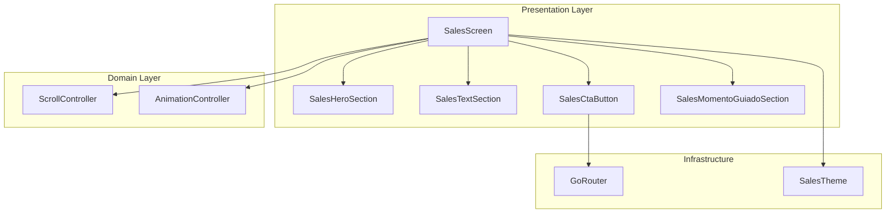
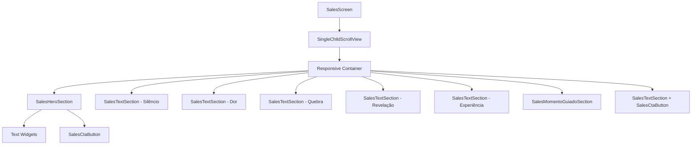

# Design Document: Sales Landing Page

## Overview

The Sales Landing Page is a contemplative, minimalist web experience built with Flutter Web that introduces visitors to the book "Não Ore, Fale com o Pai". Unlike traditional sales pages, this design prioritizes spiritual contemplation over aggressive conversion tactics, creating a sacred space for visitors to encounter the core message: God desires relationship as Father, not religious performance.

### Design Philosophy

The design follows three core principles:

1. **Contemplative Minimalism**: Black background, white text, and gold accents create a distraction-free environment that honors the spiritual nature of the content
2. **Rhythmic Pacing**: Vertical sections with generous spacing and fade-in animations guide visitors through an emotional journey at a contemplative pace
3. **Experiential Over Transactional**: The page offers a moment of spiritual connection before asking for conversion, prioritizing authentic experience over sales pressure

### Technical Context

This feature integrates into the existing `jornada_deus_pai` Flutter project, which uses:
- **Clean Architecture**: Separation of presentation, domain, and data layers
- **Riverpod**: State management and dependency injection
- **GoRouter**: Declarative routing with authentication guards
- **Supabase**: Backend authentication and data services

The landing page serves as an entry point for unauthenticated users, guiding them toward the authentication flow and ultimately the spiritual journey experience.

## Architecture

### High-Level Architecture



### Feature Structure

Following Clean Architecture, the sales landing page will be organized as:

```
lib/features/sales/
├── presentation/
│   ├── screens/
│   │   └── sales_screen.dart
│   ├── widgets/
│   │   ├── sales_hero_section.dart
│   │   ├── sales_text_section.dart
│   │   ├── sales_cta_button.dart
│   │   └── sales_momento_guiado_section.dart
│   └── providers/
│       ├── scroll_providers.dart
│       └── animation_providers.dart
├── domain/
│   └── models/
│       └── section_config.dart
└── data/
    └── constants/
        └── sales_content.dart
```

### Layer Responsibilities

**Presentation Layer**:
- Renders UI components (screens and widgets)
- Manages local UI state (scroll position, animation states)
- Handles user interactions (button clicks, scroll events)
- Consumes providers for state management

**Domain Layer**:
- Defines section configuration models
- Contains business logic for scroll behavior
- Defines animation timing and sequencing rules

**Data Layer**:
- Stores static content (section texts, styling constants)
- Provides content configuration for each section

### Navigation Flow

```mermaid
graph LR
    External[External Traffic] --> Sales[/sales route]
    Sales --> Hero[Hero Section]
    Hero -->|Scroll| Sections[Content Sections]
    Sections -->|CTA Click| Auth[/login or /signup]
    Auth -->|Success| Entry[/entry]
```

## Components and Interfaces

### Core Components

#### 1. SalesScreen (Main Container)

**Responsibility**: Orchestrates the entire landing page experience

**Interface**:
```dart
class SalesScreen extends ConsumerStatefulWidget {
  const SalesScreen({super.key});
  
  @override
  ConsumerState<SalesScreen> createState() => _SalesScreenState();
}

class _SalesScreenState extends ConsumerState<SalesScreen> {
  late ScrollController _scrollController;
  
  @override
  void initState();
  
  @override
  void dispose();
  
  void _scrollToSection(int sectionIndex);
  
  @override
  Widget build(BuildContext context, WidgetRef ref);
}
```

**Key Behaviors**:
- Initializes and manages ScrollController for smooth scrolling
- Provides scroll-to-section functionality for CTA buttons
- Renders all sections in vertical sequence
- Applies responsive layout constraints based on viewport width

#### 2. SalesHeroSection

**Responsibility**: Renders the opening section with main message and primary CTA

**Interface**:
```dart
class SalesHeroSection extends ConsumerWidget {
  final VoidCallback onCtaPressed;
  
  const SalesHeroSection({
    super.key,
    required this.onCtaPressed,
  });
  
  @override
  Widget build(BuildContext context, WidgetRef ref);
}
```

**Key Behaviors**:
- Displays main text: "Você não precisa orar… você pode falar com o Pai"
- Displays subtext: "Talvez ninguém nunca tenha te ensinado isso."
- Renders primary CTA button: "Começar agora"
- Applies fade-in animation on mount
- Responsive typography (48px desktop, 32px mobile for main text)

#### 3. SalesTextSection

**Responsibility**: Reusable component for standard content sections

**Interface**:
```dart
class SalesTextSection extends ConsumerWidget {
  final String text;
  final TextStyle? textStyle;
  final Color? textColor;
  final double verticalSpacing;
  final bool isVisible;
  
  const SalesTextSection({
    super.key,
    required this.text,
    this.textStyle,
    this.textColor,
    this.verticalSpacing = 96.0,
    this.isVisible = false,
  });
  
  @override
  Widget build(BuildContext context, WidgetRef ref);
}
```

**Key Behaviors**:
- Renders text with configurable styling
- Applies fade-in animation when `isVisible` becomes true
- Centers text horizontally
- Applies responsive padding (800px max width on desktop, 24px padding on mobile)
- Supports custom vertical spacing between sections

#### 4. SalesCtaButton

**Responsibility**: Reusable call-to-action button with hover/tap interactions

**Interface**:
```dart
class SalesCtaButton extends StatefulWidget {
  final String text;
  final VoidCallback onPressed;
  final EdgeInsets? padding;
  
  const SalesCtaButton({
    super.key,
    required this.text,
    required this.onPressed,
    this.padding,
  });
  
  @override
  State<SalesCtaButton> createState() => _SalesCtaButtonState();
}

class _SalesCtaButtonState extends State<SalesCtaButton> {
  bool _isHovered = false;
  
  @override
  Widget build(BuildContext context);
}
```

**Key Behaviors**:
- Gold background (#D4AF37), black text (#000000)
- Hover effect: opacity 0.9 (desktop only)
- Tap effect: scale 0.98 (mobile)
- 8px border radius
- Minimum 48x48px touch target
- Smooth transitions (200ms for hover, 100ms for tap)

#### 5. SalesMomentoGuiadoSection

**Responsibility**: Special section for guided spiritual moment with visual emphasis

**Interface**:
```dart
class SalesMomentoGuiadoSection extends ConsumerWidget {
  final bool isVisible;
  
  const SalesMomentoGuiadoSection({
    super.key,
    this.isVisible = false,
  });
  
  @override
  Widget build(BuildContext context, WidgetRef ref);
}
```

**Key Behaviors**:
- Displays text: "Fecha os olhos por um instante… e fala com Ele agora."
- Applies subtle gold border (1px solid #D4AF37)
- Adds 96px vertical spacing after text for contemplative pause
- Fade-in animation when visible
- Centers content horizontally

### Widget Hierarchy



### Riverpod Providers

#### Scroll Management

```dart
// Provider for scroll controller
final salesScrollControllerProvider = Provider<ScrollController>((ref) {
  final controller = ScrollController();
  ref.onDispose(() => controller.dispose());
  return controller;
});

// Provider for current scroll position
final scrollPositionProvider = StateProvider<double>((ref) => 0.0);

// Provider for section visibility tracking
final sectionVisibilityProvider = StateNotifierProvider<SectionVisibilityNotifier, Map<int, bool>>((ref) {
  return SectionVisibilityNotifier();
});

class SectionVisibilityNotifier extends StateNotifier<Map<int, bool>> {
  SectionVisibilityNotifier() : super({});
  
  void updateVisibility(int sectionIndex, bool isVisible) {
    state = {...state, sectionIndex: isVisible};
  }
}
```

#### Animation Management

```dart
// Provider for animation controllers per section
final sectionAnimationProvider = Provider.family<AnimationController, int>((ref, sectionIndex) {
  // Animation controller lifecycle managed by widget
  throw UnimplementedError('Must be overridden in widget');
});

// Provider for fade animation values
final fadeAnimationProvider = Provider.family<Animation<double>, int>((ref, sectionIndex) {
  throw UnimplementedError('Must be overridden in widget');
});
```

#### Navigation

```dart
// Provider for navigation actions
final salesNavigationProvider = Provider<SalesNavigation>((ref) {
  return SalesNavigation();
});

class SalesNavigation {
  void navigateToAuth(BuildContext context) {
    context.go(AppRoutes.login);
  }
  
  void scrollToSection(ScrollController controller, int sectionIndex) {
    final targetPosition = sectionIndex * 800.0; // Approximate section height
    controller.animateTo(
      targetPosition,
      duration: const Duration(milliseconds: 600),
      curve: Curves.easeInOut,
    );
  }
}
```

## Data Models

### SectionConfig

Defines configuration for each content section:

```dart
class SectionConfig {
  final int index;
  final String? text;
  final List<String>? multipleTexts;
  final TextStyle textStyle;
  final Color? textColor;
  final double verticalSpacing;
  final bool hasSpecialStyling;
  final Widget? customWidget;
  
  const SectionConfig({
    required this.index,
    this.text,
    this.multipleTexts,
    required this.textStyle,
    this.textColor,
    this.verticalSpacing = 96.0,
    this.hasSpecialStyling = false,
    this.customWidget,
  });
}
```

### SalesContent (Static Data)

```dart
class SalesContent {
  static const String heroMainText = 'Você não precisa orar… você pode falar com o Pai';
  static const String heroSubtext = 'Talvez ninguém nunca tenha te ensinado isso.';
  static const String heroCtaText = 'Começar agora';
  
  static const String silencioText = 'isso não é mais um livro espiritual';
  
  static const String dorQuestion1 = 'Você já orou… e sentiu que ninguém estava ouvindo?';
  static const String dorQuestion2 = 'Já tentou fazer tudo certo… e mesmo assim sentiu vazio?';
  
  static const String quebraText = 'E se o problema nunca foi você… mas a forma como te ensinaram?';
  
  static const String revelacaoText = 'Deus nunca quis distância. Ele sempre quis ser Pai.';
  
  static const String experienciaText = 'Este livro não vai te ensinar a orar melhor. Vai te mostrar algo mais simples: voltar a falar com o Pai.';
  
  static const String momentoGuiadoText = 'Fecha os olhos por um instante… e fala com Ele agora.';
  
  static const String ctaFinalText = 'Se você quer continuar isso…';
  static const String ctaFinalButtonText = 'Entrar no Secreto';
  
  static List<SectionConfig> get sections => [
    // Section configurations defined here
  ];
}
```

### ResponsiveBreakpoints

```dart
class ResponsiveBreakpoints {
  static const double desktop = 1024.0;
  static const double tablet = 768.0;
  static const double mobile = 0.0;
  
  static bool isDesktop(BuildContext context) {
    return MediaQuery.of(context).size.width >= desktop;
  }
  
  static bool isMobile(BuildContext context) {
    return MediaQuery.of(context).size.width < desktop;
  }
}
```

## Error Handling

### Error Scenarios

1. **Navigation Failures**
   - **Scenario**: GoRouter fails to navigate to auth screens
   - **Handling**: Log error, show toast notification, retry navigation
   - **User Experience**: Graceful fallback with clear error message

2. **Animation Performance Issues**
   - **Scenario**: Animations stutter on low-end devices
   - **Handling**: Detect performance issues, reduce animation complexity
   - **User Experience**: Disable animations if frame rate drops below 30fps

3. **Scroll Controller Disposal**
   - **Scenario**: ScrollController not properly disposed
   - **Handling**: Use Riverpod's `ref.onDispose` to ensure cleanup
   - **User Experience**: Prevent memory leaks

4. **Viewport Size Edge Cases**
   - **Scenario**: Unusual viewport dimensions (very narrow or very wide)
   - **Handling**: Apply min/max constraints to layout
   - **User Experience**: Content remains readable at all viewport sizes

### Error Handling Implementation

```dart
// Navigation error handling
void _handleNavigation(BuildContext context, WidgetRef ref) {
  try {
    context.go(AppRoutes.login);
  } catch (e) {
    // Log error
    debugPrint('Navigation error: $e');
    
    // Show user-friendly message
    ScaffoldMessenger.of(context).showSnackBar(
      const SnackBar(
        content: Text('Não foi possível navegar. Tente novamente.'),
        duration: Duration(seconds: 3),
      ),
    );
  }
}

// Animation performance monitoring
class PerformanceMonitor {
  static bool shouldReduceAnimations(BuildContext context) {
    // Check if reduce motion is enabled in accessibility settings
    final reduceMotion = MediaQuery.of(context).disableAnimations;
    return reduceMotion;
  }
}
```

## Testing Strategy

### Testing Approach

Since this feature is primarily UI rendering and layout with animations, **property-based testing is NOT applicable**. The testing strategy focuses on:

1. **Widget Tests**: Verify component rendering and interactions
2. **Integration Tests**: Verify navigation flow and scroll behavior
3. **Visual Regression Tests**: Ensure consistent visual appearance
4. **Accessibility Tests**: Verify semantic labels and keyboard navigation

### Unit Tests

**Widget Rendering Tests**:
- Verify SalesHeroSection renders all text elements
- Verify SalesTextSection applies correct styling
- Verify SalesCtaButton renders with correct colors
- Verify SalesMomentoGuiadoSection applies gold border

**Interaction Tests**:
- Verify CTA button triggers navigation callback
- Verify hover state changes button opacity
- Verify tap state scales button on mobile

**Responsive Layout Tests**:
- Verify desktop layout uses 800px max width
- Verify mobile layout uses 24px padding
- Verify typography scales correctly at breakpoints

**Example Test**:
```dart
testWidgets('SalesHeroSection renders main text and CTA', (tester) async {
  bool ctaPressed = false;
  
  await tester.pumpWidget(
    MaterialApp(
      home: Scaffold(
        body: SalesHeroSection(
          onCtaPressed: () => ctaPressed = true,
        ),
      ),
    ),
  );
  
  // Verify main text is present
  expect(find.text('Você não precisa orar… você pode falar com o Pai'), findsOneWidget);
  
  // Verify subtext is present
  expect(find.text('Talvez ninguém nunca tenha te ensinado isso.'), findsOneWidget);
  
  // Verify CTA button is present
  expect(find.text('Começar agora'), findsOneWidget);
  
  // Tap CTA and verify callback
  await tester.tap(find.text('Começar agora'));
  expect(ctaPressed, isTrue);
});
```

### Integration Tests

**Navigation Flow Tests**:
- Verify clicking "Começar agora" scrolls to final CTA section
- Verify clicking "Entrar no Secreto" navigates to login screen
- Verify back navigation returns to sales page

**Scroll Behavior Tests**:
- Verify smooth scroll animation completes in 600ms
- Verify sections fade in when 20% visible
- Verify sequential delay of 200ms between section animations

**Example Test**:
```dart
testWidgets('CTA button navigates to login screen', (tester) async {
  await tester.pumpWidget(
    ProviderScope(
      child: MaterialApp.router(
        routerConfig: AppRouter.router,
      ),
    ),
  );
  
  // Navigate to sales page
  await tester.pumpAndSettle();
  
  // Find and tap final CTA button
  await tester.tap(find.text('Entrar no Secreto'));
  await tester.pumpAndSettle();
  
  // Verify navigation to login screen
  expect(find.byType(LoginScreen), findsOneWidget);
});
```

### Accessibility Tests

**Semantic Labels**:
- Verify all CTA buttons have semantic labels
- Verify text contrast ratios meet WCAG AA standards (4.5:1)

**Keyboard Navigation**:
- Verify Tab key moves focus between interactive elements
- Verify Enter key activates focused CTA button

**Screen Reader Support**:
- Verify sections have proper semantic structure
- Verify images (if any) have alt text

**Example Test**:
```dart
testWidgets('CTA button has semantic label', (tester) async {
  await tester.pumpWidget(
    MaterialApp(
      home: Scaffold(
        body: SalesCtaButton(
          text: 'Começar agora',
          onPressed: () {},
        ),
      ),
    ),
  );
  
  // Verify semantic label exists
  final semantics = tester.getSemantics(find.text('Começar agora'));
  expect(semantics.label, isNotEmpty);
});
```

### Visual Regression Tests

Use Flutter's golden file testing to capture and compare screenshots:

```dart
testWidgets('SalesScreen matches golden file', (tester) async {
  await tester.pumpWidget(
    ProviderScope(
      child: MaterialApp(
        home: SalesScreen(),
      ),
    ),
  );
  
  await expectLater(
    find.byType(SalesScreen),
    matchesGoldenFile('goldens/sales_screen.png'),
  );
});
```

### Performance Tests

**Animation Performance**:
- Verify animations maintain 60fps on target devices
- Verify scroll performance with large content

**Load Time**:
- Verify initial render completes within 2 seconds on 3G connection
- Verify lazy loading of below-fold sections

## Implementation Notes

### Animation Implementation

Use `AnimatedOpacity` for fade-in effects:

```dart
AnimatedOpacity(
  opacity: isVisible ? 1.0 : 0.0,
  duration: const Duration(milliseconds: 700),
  curve: Curves.easeOut,
  child: child,
)
```

### Scroll Detection

Use `ScrollController` with listener to detect section visibility:

```dart
_scrollController.addListener(() {
  final scrollPosition = _scrollController.position.pixels;
  final viewportHeight = MediaQuery.of(context).size.height;
  
  // Calculate which sections are visible
  for (int i = 0; i < sections.length; i++) {
    final sectionTop = i * viewportHeight;
    final sectionBottom = sectionTop + viewportHeight;
    final visibilityThreshold = sectionTop + (viewportHeight * 0.2);
    
    if (scrollPosition >= visibilityThreshold && scrollPosition < sectionBottom) {
      ref.read(sectionVisibilityProvider.notifier).updateVisibility(i, true);
    }
  }
});
```

### Responsive Typography

Use `MediaQuery` to determine font sizes:

```dart
TextStyle getResponsiveTextStyle(BuildContext context, {
  required double desktopSize,
  required double mobileSize,
}) {
  final isDesktop = ResponsiveBreakpoints.isDesktop(context);
  return TextStyle(
    fontSize: isDesktop ? desktopSize : mobileSize,
    fontWeight: FontWeight.w300,
    color: Colors.white,
    height: 1.6,
  );
}
```

### Theme Extension

Create a dedicated theme extension for sales page:

```dart
class SalesTheme {
  static const Color backgroundColor = Color(0xFF000000);
  static const Color textColor = Color(0xFFFFFFFF);
  static const Color accentColor = Color(0xFFD4AF37); // Gold
  
  static const double desktopMaxWidth = 800.0;
  static const double mobilePadding = 24.0;
  
  static const double heroFontSizeDesktop = 48.0;
  static const double heroFontSizeMobile = 32.0;
  
  static const double bodyFontSizeDesktop = 24.0;
  static const double bodyFontSizeMobile = 18.0;
  
  static const double sectionSpacingDesktop = 96.0;
  static const double sectionSpacingMobile = 64.0;
}
```

### Router Integration

Add sales route to `AppRouter`:

```dart
GoRoute(
  path: AppRoutes.sales,
  name: AppRoutes.salesName,
  builder: (context, state) => const SalesScreen(),
),
```

Add route constants to `AppRoutes`:

```dart
class AppRoutes {
  // ... existing routes
  static const String sales = '/sales';
  static const String salesName = 'sales';
}
```

### Performance Optimizations

1. **Lazy Loading**: Use `ListView.builder` instead of `Column` for sections
2. **Const Constructors**: Mark all widgets as `const` where possible
3. **Memoization**: Cache computed values in providers
4. **GPU Acceleration**: Use `Transform` instead of `Container` for animations

```dart
// Optimized section rendering
ListView.builder(
  controller: _scrollController,
  itemCount: sections.length,
  itemBuilder: (context, index) {
    final section = sections[index];
    final isVisible = ref.watch(sectionVisibilityProvider)[index] ?? false;
    
    return SalesTextSection(
      text: section.text,
      textStyle: section.textStyle,
      isVisible: isVisible,
    );
  },
)
```

---

## Summary

This design document provides a comprehensive blueprint for implementing the Sales Landing Page feature in Flutter Web. The architecture follows Clean Architecture principles with clear separation of concerns, uses Riverpod for state management, and prioritizes contemplative user experience through minimalist design and smooth animations.

Key design decisions:
- **No Property-Based Testing**: This is a UI rendering feature, so testing focuses on widget tests, integration tests, and visual regression tests
- **Riverpod for State**: Scroll position and animation states managed through providers
- **Responsive Design**: Breakpoint-based layout with mobile-first approach
- **Performance First**: GPU-accelerated animations and lazy loading
- **Accessibility**: Semantic labels, keyboard navigation, and WCAG compliance

The implementation will integrate seamlessly with the existing `jornada_deus_pai` project structure and authentication flow.
