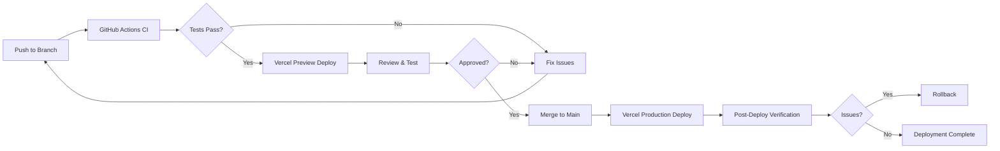

# Deployment Guide

This document provides instructions for deploying the Interactive Spiritual Book System to production using Vercel.

## Table of Contents

- [Prerequisites](#prerequisites)
- [Vercel Deployment Setup](#vercel-deployment-setup)
- [Environment Variables Configuration](#environment-variables-configuration)
- [Preview Deployments](#preview-deployments)
- [Production Deployment](#production-deployment)
- [Rollback Procedures](#rollback-procedures)
- [Monitoring and Logs](#monitoring-and-logs)

## Prerequisites

Before deploying, ensure you have:

1. A GitHub account with this repository
2. A Vercel account (sign up at [vercel.com](https://vercel.com))
3. A Supabase project with:
   - Database schema deployed (see `supabase/schema.sql`)
   - Chapters seeded (see `supabase/seed-chapters.sql`)
   - Row Level Security policies enabled
4. All required environment variables (see below)

## Vercel Deployment Setup

### Step 1: Connect GitHub Repository to Vercel

1. Log in to your [Vercel Dashboard](https://vercel.com/dashboard)
2. Click **"Add New Project"**
3. Select **"Import Git Repository"**
4. Choose your GitHub repository for this project
5. Authorize Vercel to access your GitHub account if prompted

### Step 2: Configure Project Settings

Vercel will automatically detect that this is a Next.js project. Verify the following settings:

- **Framework Preset**: Next.js
- **Root Directory**: `./` (project root)
- **Build Command**: `npm run build` (default)
- **Output Directory**: `.next` (default)
- **Install Command**: `npm ci` (default)
- **Node.js Version**: 20.x

### Step 3: Configure Environment Variables

Before deploying, you must configure the required environment variables in Vercel.

#### Required Environment Variables

Navigate to **Project Settings → Environment Variables** and add:

| Variable Name | Description | Where to Find | Environment |
|--------------|-------------|---------------|-------------|
| `NEXT_PUBLIC_SUPABASE_URL` | Your Supabase project URL | Supabase Dashboard → Settings → API | Production, Preview, Development |
| `NEXT_PUBLIC_SUPABASE_ANON_KEY` | Your Supabase anonymous key | Supabase Dashboard → Settings → API | Production, Preview, Development |

**Important Notes:**
- Variables prefixed with `NEXT_PUBLIC_` are exposed to the browser
- Use the **Production** environment for your main Supabase project
- Optionally, use a separate Supabase project for **Preview** deployments
- Never commit these values to version control

#### How to Add Environment Variables in Vercel

1. Go to your project in Vercel Dashboard
2. Navigate to **Settings → Environment Variables**
3. For each variable:
   - Enter the **Key** (variable name)
   - Enter the **Value** (from Supabase)
   - Select which environments to apply to:
     - ✅ **Production** (main branch deployments)
     - ✅ **Preview** (PR and branch deployments)
     - ✅ **Development** (local development via `vercel dev`)
4. Click **Save**

### Step 4: Deploy

1. Click **"Deploy"** in Vercel
2. Vercel will:
   - Clone your repository
   - Install dependencies
   - Run the build process
   - Deploy to a production URL
3. Wait for the deployment to complete (typically 2-3 minutes)
4. Once complete, you'll receive a production URL (e.g., `your-app.vercel.app`)

## Environment Variables Configuration

### Supabase Configuration

#### Getting Your Supabase Credentials

1. Log in to [Supabase Dashboard](https://app.supabase.com)
2. Select your project
3. Navigate to **Settings → API**
4. Copy the following values:
   - **Project URL**: This is your `NEXT_PUBLIC_SUPABASE_URL`
   - **anon public**: This is your `NEXT_PUBLIC_SUPABASE_ANON_KEY`

#### Supabase Setup Checklist

Before deploying, ensure your Supabase project has:

- ✅ Database schema created (run `supabase/schema.sql`)
- ✅ Initial chapters seeded (run `supabase/seed-chapters.sql`)
- ✅ Row Level Security (RLS) policies enabled on all tables
- ✅ Authentication providers configured (Email/Password enabled)
- ✅ Session configuration set (see `supabase/SESSION_CONFIGURATION.md`)

### Optional Environment Variables

You can add these optional variables for additional features:

| Variable Name | Description | Default | Example |
|--------------|-------------|---------|---------|
| `SEAL_UNLOCK_CONDITION` | When to award the digital seal | `journey_complete` | `first_message` or `journey_complete` |
| `NEXT_PUBLIC_APP_URL` | Your application's public URL | Auto-detected | `https://your-app.vercel.app` |

## Preview Deployments

Vercel automatically creates preview deployments for:
- Every pull request
- Every push to non-production branches

### Preview Deployment Features

- **Unique URL**: Each preview gets a unique URL (e.g., `your-app-git-feature-branch.vercel.app`)
- **Automatic Updates**: Preview deployments update automatically when you push new commits
- **Environment Variables**: Preview deployments use the "Preview" environment variables
- **Comments on PRs**: Vercel automatically comments on GitHub PRs with the preview URL

### Testing Preview Deployments

1. Create a feature branch: `git checkout -b feature/my-feature`
2. Make your changes and commit
3. Push to GitHub: `git push origin feature/my-feature`
4. Create a pull request on GitHub
5. Vercel will automatically deploy a preview
6. Click the preview URL in the PR comment to test your changes

### Preview Environment Best Practices

- Use a separate Supabase project for preview deployments to avoid affecting production data
- Configure preview-specific environment variables in Vercel
- Test authentication, data operations, and all critical features in preview before merging

## Production Deployment

### Automatic Production Deployment

Vercel automatically deploys to production when you:
- Push to the `main` branch
- Merge a pull request into `main`

### Manual Production Deployment

To manually trigger a production deployment:

1. Go to Vercel Dashboard → Your Project
2. Navigate to **Deployments** tab
3. Find the deployment you want to promote
4. Click **"Promote to Production"**

### Production Deployment Checklist

Before deploying to production:

- ✅ All tests pass in CI/CD pipeline
- ✅ Preview deployment tested and verified
- ✅ Database migrations applied to production Supabase
- ✅ Environment variables configured correctly
- ✅ No breaking changes to API or database schema
- ✅ Accessibility tested (keyboard navigation, screen readers)
- ✅ Performance tested (Lighthouse score, load times)

### Post-Deployment Verification

After production deployment:

1. **Verify Application Loads**: Visit your production URL
2. **Test Authentication**: Sign up and log in
3. **Test Core Features**:
   - Landing page displays correctly
   - First chapter loads
   - Message submission works
   - Progress tracking updates
   - Chapter unlocking works
4. **Check Error Monitoring**: Review Vercel logs for any errors
5. **Test on Mobile**: Verify responsive design on mobile devices

## Rollback Procedures

If a deployment causes issues, you can quickly rollback:

### Instant Rollback via Vercel Dashboard

1. Go to Vercel Dashboard → Your Project → **Deployments**
2. Find the last known good deployment
3. Click the **three dots (⋯)** menu
4. Select **"Promote to Production"**
5. Confirm the rollback

The rollback is instant and takes effect immediately.

### Rollback via Git

Alternatively, rollback by reverting the Git commit:

```bash
# Find the commit to revert
git log --oneline

# Revert the problematic commit
git revert <commit-hash>

# Push to trigger new deployment
git push origin main
```

### Database Rollback

If the deployment included database changes:

1. Review the database migration that was applied
2. Create a rollback migration if needed
3. Apply the rollback migration to Supabase
4. Verify data integrity

**Important**: Always test database migrations in a staging environment first.

## Monitoring and Logs

### Vercel Logs

Access deployment and runtime logs:

1. Go to Vercel Dashboard → Your Project
2. Navigate to **Deployments** tab
3. Click on a deployment to view:
   - Build logs
   - Function logs (API routes)
   - Edge logs (middleware)

### Real-Time Logs

View real-time logs during deployment:

```bash
# Install Vercel CLI
npm i -g vercel

# Login to Vercel
vercel login

# View logs
vercel logs <deployment-url>
```

### Error Monitoring

Vercel provides basic error monitoring. For advanced monitoring, consider integrating:

- **Sentry**: Error tracking and performance monitoring
- **LogRocket**: Session replay and error tracking
- **Datadog**: Full-stack observability

### Performance Monitoring

Monitor application performance:

1. **Vercel Analytics**: Built-in analytics (enable in project settings)
2. **Web Vitals**: Core Web Vitals tracking
3. **Lighthouse**: Run regular Lighthouse audits

### Supabase Monitoring

Monitor your Supabase backend:

1. Go to Supabase Dashboard → Your Project
2. Navigate to **Database → Logs** for query logs
3. Navigate to **Auth → Logs** for authentication logs
4. Set up alerts for:
   - High error rates
   - Slow queries
   - Authentication failures

## Continuous Deployment Workflow

The complete CI/CD workflow:



## Troubleshooting

### Common Deployment Issues

#### Build Fails with "Module not found"

**Cause**: Missing dependency or incorrect import path

**Solution**:
```bash
# Ensure all dependencies are in package.json
npm install <missing-package>

# Verify import paths are correct
# Check for case-sensitive file names
```

#### Environment Variables Not Working

**Cause**: Variables not configured in Vercel or incorrect environment selected

**Solution**:
1. Verify variables are set in Vercel Dashboard
2. Ensure correct environment is selected (Production/Preview/Development)
3. Redeploy after adding variables

#### Supabase Connection Fails

**Cause**: Incorrect Supabase URL or key, or RLS policies blocking access

**Solution**:
1. Verify `NEXT_PUBLIC_SUPABASE_URL` and `NEXT_PUBLIC_SUPABASE_ANON_KEY`
2. Check Supabase Dashboard → Settings → API for correct values
3. Verify RLS policies allow authenticated access
4. Check Supabase logs for connection errors

#### 404 on Dynamic Routes

**Cause**: Next.js routing configuration issue

**Solution**:
1. Verify file structure matches Next.js App Router conventions
2. Check `next.config.mjs` for any custom routing
3. Ensure dynamic routes use correct bracket syntax `[param]`

### Getting Help

If you encounter issues:

1. Check [Vercel Documentation](https://vercel.com/docs)
2. Check [Next.js Documentation](https://nextjs.org/docs)
3. Check [Supabase Documentation](https://supabase.com/docs)
4. Review GitHub Actions logs for CI/CD issues
5. Contact support or open an issue in the repository

## Security Best Practices

### Environment Variables

- ✅ Never commit `.env.local` to version control
- ✅ Use different Supabase projects for production and preview
- ✅ Rotate keys periodically
- ✅ Use Vercel's encrypted environment variables

### Supabase Security

- ✅ Enable Row Level Security (RLS) on all tables
- ✅ Use the `anon` key for client-side operations
- ✅ Never expose the `service_role` key to the client
- ✅ Regularly review RLS policies

### Vercel Security

- ✅ Enable Vercel Authentication for team access
- ✅ Use deployment protection for production
- ✅ Enable DDoS protection
- ✅ Configure security headers in `next.config.mjs`

## Additional Resources

- [Vercel Next.js Deployment Guide](https://vercel.com/docs/frameworks/nextjs)
- [Supabase Production Checklist](https://supabase.com/docs/guides/platform/going-into-prod)
- [Next.js Deployment Documentation](https://nextjs.org/docs/deployment)
- [GitHub Actions Documentation](https://docs.github.com/en/actions)

---

**Last Updated**: 2025  
**Maintained By**: Development Team
